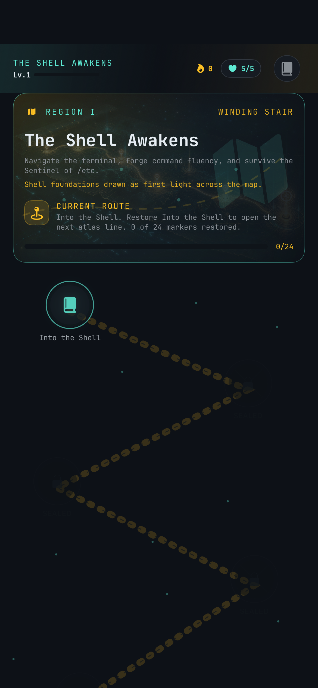
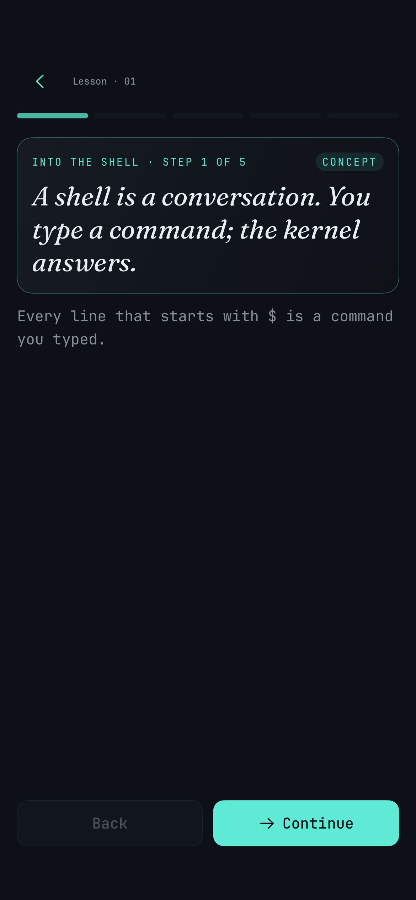
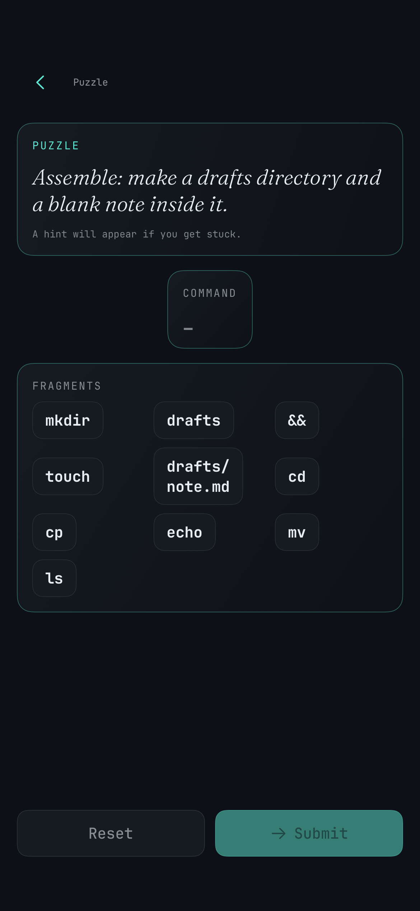

# Shell Atlas

Shell Atlas teaches Linux command-line fundamentals through a star-map campaign, fast practice loops, and a safe simulated terminal.

[Visit the official site](https://shellatlas.app/)

## How It Works

Shell Atlas turns terminal basics into short iOS sessions. You follow a narrative campaign, unlock command stars, practice with lessons and puzzles, and return to a spaced-review Vault so the commands stick.

## Screenshots

  
  
  

## Proof Points

- Campaign map: commands become route markers in a constellation-style atlas.
- Lessons: beginner command concepts are taught in small readable steps.
- Practice: puzzles assemble real shell commands from safe fragments.
- Review loop: progress returns to the map and feeds future practice.

## Product Facts

- Product: Shell Atlas
- Platform: iPhone, iPad, and Mac Catalyst planned
- Category: education and reference
- Focus: Linux shell basics, command fluency, and spaced review
- Privacy posture: private by design, with no source code published in this repository

## Source Code Boundary

This public GitHub repository is a promotional stub only. The Shell Atlas source code, build system, private configuration, internal documentation, release workflows, and local app artifacts are not published here.
